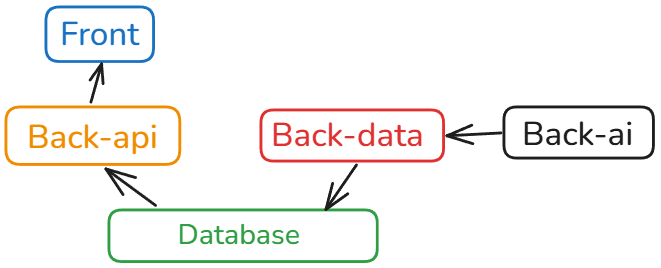

Medianalytics is an open-source platform that processes 5 main articles daily from each registered source (media outlets, organizations, etc) and provides users with tools to view this information from a broader perspective through comprehensive data visualization and analysis.

## 📋 Prerequisites

This project uses Docker to run the application. Make sure you have Docker installed on your machine.
You can download it from [Docker](https://www.docker.com/get-started).

## 🏗️ Architecture Schema



## ⚙️ Setup Instructions

1. **Create a `.env` file**

   In the `root` folder `medianalytics`, create a `.env` file based on this example file and set your environment variables accordingly.

   ```sh
   DATABASE_URL=postgresql+asyncpg://dockeruser:**db_password**@db:5432/medianalytics
   DB_PASSWORD=**db_password**
   API_KEY=example # AI API key
   GOOGLE_AI_API_URL=example
   VERIFY_SSL=example
   CONNECTION_TIMEOUT=example
   READ_TIMEOUT=example
   RETRIES=example
   MAX_CONNECTIONS=example
   MAX_KEEPALIVE_CONNECTIONS=example
   # Only if you plan to use X API
   X_API_KEY=example
   X_API_SECRET=example
   X_ACCESS_TOKEN=example
   X_ACCESS_TOKEN_SECRET=example
   ```

### Back-ai

2. **Get an AI API key**

- Recommended: [Google AI](https://ai.google.dev/) (free tier available with gemma-3-27b-it)

On `root` folder medianalytics:

3. **Launch Application**
   ```sh
   docker compose up
   ```

### Back-data

4. **Database Migration Setup**

   In the back-data **docker container** terminal **Exec**:

   ```sh
   alembic init alembic
   ```

5. **Configure Alembic**

   In the **local** `Back-data/` directory:

   Edit `alembic.ini` file to set the database URL:

   ```ini
   sqlalchemy.url = postgresql+asyncpg://dockeruser:**db_password**@db:5432/medianalytics
   ```

In the back-data **docker container** terminal **Exec**:

6. **Generate Migration Script**

   ```sh
   alembic revision --autogenerate -m "Initial migration"
   ```

7. **Apply Migration**

   ```sh
   alembic upgrade head
   ```

8. **Initialize Database**
    ```sh
    python3 init_db.py
    ```

## 📝 Important Notes

- Keep containers running for scheduled jobs to execute as specified in `Back-data/main.py`
- Frontend can also run locally as an Angular project (v19.0.6)
- To add new sources, follow the example in `Back-data/media_test_scrap.py`
